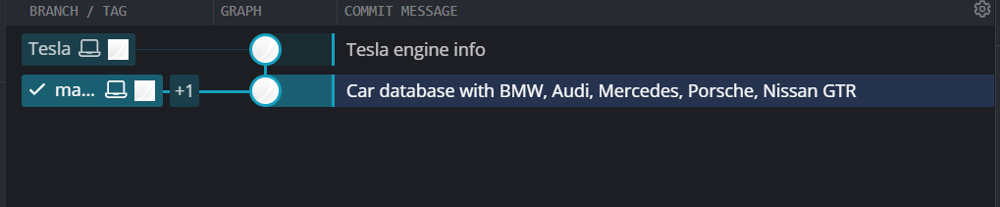
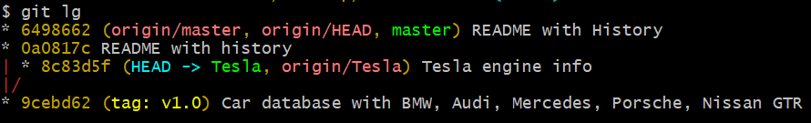

# Car-Database-GitProject

This repo shows my Git homework.

 ## Project Overview
- I created a small car database project with multiple commits.
- The main branch (`master`) has a **cleaned-up commit history**.
- I simulated a mistake by adding a commit and then removing it from `master`.
- The lost commit was **recovered** and placed in a separate branch named `Tesla`.

## Git Alias
I made a Git alias to show commit history:

```bash
git config --global alias.lg "log --oneline --graph --decorate --all"
```

Use:

```bash
git lg
```

Screenshot of commit history:




## Branches
There is a branch named 'Tesla' with a recovered commit as a mistake from sharing engine info.

